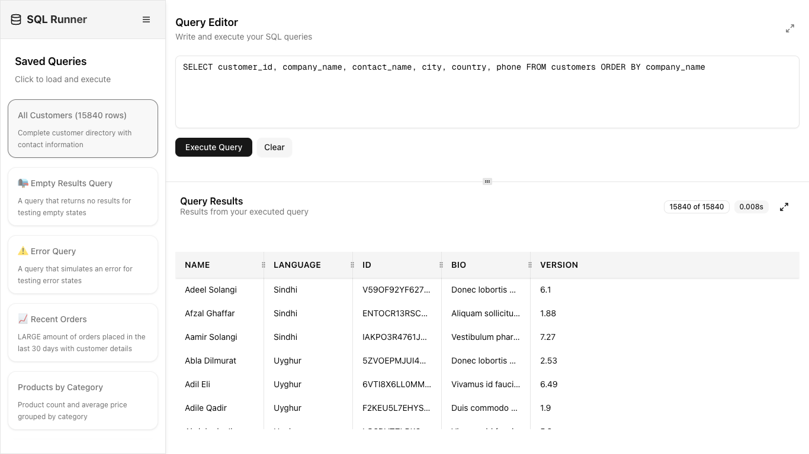

# SQL Query Runner - Frontend Engineering Challenge

[🌐 **Live Site:** sql-runner-ux.imanish.com](https://sql-runner-ux.imanish.com)

A web-based application capable of running SQL queries and displaying results, built for Frontend Engineering challenge.

## 🎥 Demo Video

[**👉 Watch the Demo Video on Youtube**](https://youtu.be/DvrZ9wxiPc0)

**SCREENSHOT:**



## 📋 Challenge Overview

This application is designed to simulate a SQL query runner interface that a data analyst would use throughout their workday. While this is a dummy application that doesn't connect to a real database, it provides an intuitive interface for writing SQL queries and viewing tabular results.

## ✍🏻 Documentation

For detailed insights into the project's ideation, design decisions, and performance metrics, refer to the following documents:

- [Ideation](/docs/1.%20Ideation.md) - Initial ideas and feature brainstorming
- [Design](/docs/2.%20Design.md) - Detailed design specifications and architecture
- [Performance](/docs/Performance.md) - Performance analysis and metrics

## 🛠 Technology Stack

- **Framework**: [Next.js 15](https://nextjs.org)
- **Language**: [TypeScript](https://www.typescriptlang.org/) for type safety and maintainability
- **Styling**: [Tailwind CSS v4](https://tailwindcss.com/) with [shadcn/ui](https://ui.shadcn.com/) for pre-built accessible components. ShadCN internally uses [Radix UI](https://www.radix-ui.com/) primitives.
- **Table & Virtualization**: [@tanstack/react-table](https://tanstack.com/table/latest) & [@tanstack/react-virtual](https://tanstack.com/virtual/latest)
  - Virtualization is implemented to efficiently handle large datasets and ensure smooth scrolling and interaction.
- **Icons**: [lucide-react](https://lucide.dev/)
- **Testing**: [Vitest](https://vitest.dev/) & [React Testing Library](https://testing-library.com/docs/react-testing-library/intro/)
- **Linting**: [ESLint](https://eslint.org/) with [eslint-config-next](https://nextjs.org/docs/pages/building-your-application/configuring/eslint)
- **Utilities**: [clsx](https://github.com/lukeed/clsx), [tailwind-merge](https://github.com/dcastil/tailwind-merge), [class-variance-authority](https://cva.style/) to manage conditional class names and Tailwind CSS variants.
- **Resizable Panels**: [react-resizable-panels](https://github.com/bvaughn/react-resizable-panels) to allow users to adjust the size of the query editor and results pane.
- **Dialog & Primitives**: [@radix-ui/react-dialog](https://www.radix-ui.com/primitives/docs/components/dialog), [@radix-ui/react-separator](https://www.radix-ui.com/primitives/docs/components/separator), [@radix-ui/react-slot](https://www.radix-ui.com/primitives/docs/components/slot). These are added by components from shadcn/ui, and can be used directly if needed.

## 📁 Project Structure

```
public/
  ├── data/                # Static JSON datasets
  └── ...                  # Static assets (SVGs, images, etc.)
src/
  ├── app/                 # Next.js app router (pages, layouts)
  ├── components/
  │   ├── ui/              # Base UI components (shadcn/ui)
  │   ├── query-editor/    # Query editor feature (components, hooks)
  │   ├── query-runner/    # Query runner feature (components, hooks)
  │   ├── results-panel/   # Results panel feature (components, hooks)
  │   └── sidebar/         # Sidebar feature (components, data)
  ├── utils/               # Shared utility functions
  └── types.ts             # Global TypeScript types
```

### Application Architecture Diagram


## 🎨 Design Philosophy

The application is built on these core principles:

- **User-Centric Workflows**: Designed for real-world data analyst tasks—fast query input, instant results, and seamless switching between queries.
- **Performance**: Prioritizing speed with optimized rendering, virtualization for large datasets, and minimal load times.
- **Accessibility by Design**: Every UI component is crafted for keyboard navigation, screen reader compatibility, and high-contrast viewing, following WCAG 2.2 AA standards and accessibility best practices.
- **Future-Proof Scalability**: The modular, feature-based folder structure supports easy extension, maintenance, and the addition of new features.

## 🚀 Getting Started

If you just wanna try out the app, visit the [Live Demo](https://sql-runner-ux.imanish.com). If you want to run it locally, follow the steps below.

### Prerequisites

- Node.js 18+
- npm

### Installation

1. Clone the repository

   ```bash
   git clone https://github.com/imanish003/SQL-Runner-UX
   ```

2. Install dependencies

   ```bash
   npm install
   ```

3. Run the development server

   ```bash
   npm run dev
   ```

4. Open [http://localhost:3000](http://localhost:3000) in your browser

## 🧪 Testing

Run the test suite:

```bash
npm run test
```
